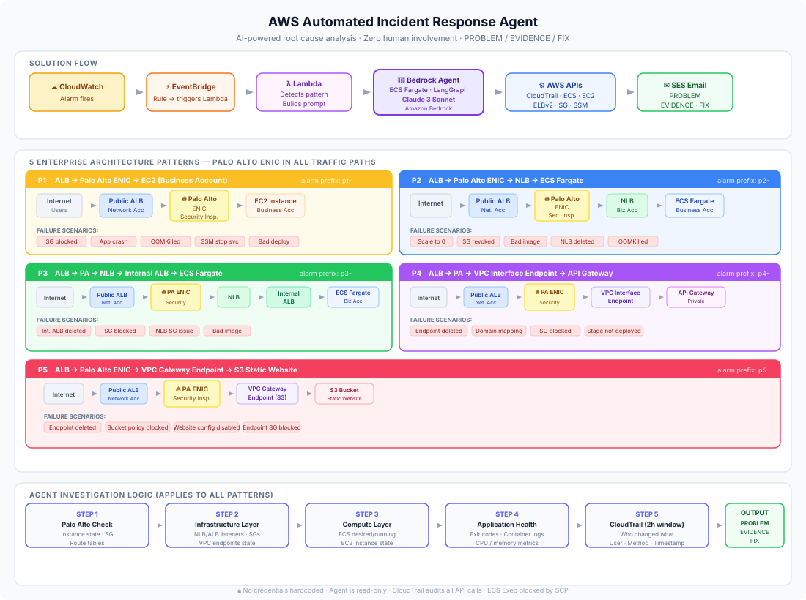

# AWS Automated Incident Response Agent

An AI-powered agent that automatically investigates AWS infrastructure incidents, identifies root causes, and emails a structured **PROBLEM / EVIDENCE / FIX** report — with zero human involvement.



## What it does

When a CloudWatch alarm fires, on-call engineers typically spend 15–60 minutes manually investigating across CloudTrail, ECS, EC2, ALB, and Security Groups. This system replaces that manual work with an AI agent that completes the same investigation in **under 2 minutes** and sends an email with the exact cause, who made the change, and the fix command.

### Sample output

```
Subject: 🔗 ALB → PA → NLB → ECS Incident

PROBLEM
ECS service `my-app` was manually scaled to desiredCount:0,
causing all tasks to stop.

EVIDENCE
- 2026-08-14T04:23:36Z: UpdateService API call set desiredCount:0
- 2026-08-14T04:23:46Z: Target 10.0.2.252:80 deregistered from ALB TG
- Current: DesiredCount=0, RunningCount=0, no healthy targets

FIX
aws ecs update-service \
  --cluster my-cluster \
  --service my-app \
  --desired-count 1 \
  --region us-east-1
```

## Architecture

```
CloudWatch Alarm
      │
      ▼
   SNS Topic
      │
      ▼
  Lambda (webhook)        ← detects alarm pattern, builds investigation prompt
      │
      ▼
Agent ALB (HTTP)
      │
      ▼
ECS Fargate (agent)       ← LangGraph ReAct loop
      │
      ├── Amazon Bedrock (Claude 3 Sonnet) ← decides which APIs to call
      │
      └── AWS APIs        ← CloudTrail, ECS, EC2, ELBv2, SG, SSM, CloudWatch
      │
      ▼
Amazon SES                ← sends PROBLEM/EVIDENCE/FIX email
```

## Supported architecture patterns

The agent supports 5 common multi-account AWS architecture patterns. Each pattern includes an **inline security inspection layer** — tested with Palo Alto ENIC, but the investigation logic works with any equivalent appliance (AWS Network Firewall, Cisco FTD, Fortinet, etc.). Alarm names must be prefixed with the pattern code so Lambda routes to the correct investigation prompt.

| Prefix | Traffic path |
|--------|-------------|
| `p1-`  | ALB → Security Inspection Layer → EC2 |
| `p2-`  | ALB → Security Inspection Layer → NLB → ECS Fargate |
| `p3-`  | ALB → Security Inspection Layer → NLB → Internal ALB → ECS Fargate |
| `p4-`  | ALB → Security Inspection Layer → VPC Endpoint → API Gateway |
| `p5-`  | ALB → Security Inspection Layer → VPC Endpoint → S3 static site |

The agent always checks the security/inspection tier **first** before investigating downstream components — regardless of which vendor or appliance you use. Swap the inspection-layer API calls in `lambda_function.py` for your appliance's equivalent (EC2 instance state, SG rules, route tables).

## Investigation logic

For every alarm the agent follows this order:

1. **Security/inspection layer** — instance state, SG, route tables
2. **Infrastructure layer** — NLB/ALB listeners, SGs, VPC endpoints
3. **Compute layer** — ECS desiredCount/runningCount, EC2 state
4. **Application health** — container exit codes, logs, CPU/memory
5. **CloudTrail (last 2 hours only)** — who changed what and when

Only CloudTrail events from the **last 2 hours** are treated as root cause. This prevents stale audit events from creating false positives.

## Tech stack

| Component | Technology |
|-----------|-----------|
| AI model | Claude 3 Sonnet via Amazon Bedrock |
| Agent framework | LangGraph ReAct |
| Agent runtime | ECS Fargate (FastAPI + uvicorn) |
| Trigger | Lambda → SNS |
| Email | Amazon SES |
| AWS API access | boto3 with optional cross-account IAM role |

## Repository structure

```
aws-incident-response-agent/
├── agent/
│   ├── agent.py              # FastAPI app + LangGraph agent
│   ├── tools/
│   │   └── generic.py        # aws_api_call tool (calls any boto3 method)
│   ├── requirements.txt
│   └── Dockerfile
├── lambda/
│   └── lambda_function.py    # SNS webhook → builds prompt → calls agent
├── infra/
│   ├── provision_ecs_app.sh  # Deploy ECS target app + CloudWatch alarms
│   ├── provision_vpc_endpoints.sh  # VPC endpoints for Bedrock/ECR/SES
│   └── provision_eks_app.sh  # EKS variant (requires eks:CreateCluster permission)
├── docs/
│   └── architecture.svg
├── .env.example              # All required environment variables
└── README.md
```

## Getting started

### Prerequisites

- AWS CLI configured with appropriate permissions
- Docker (for building the agent image)
- Amazon Bedrock access enabled for Claude 3 Sonnet in your region
- Amazon SES with verified sender/recipient email addresses

### 1. Clone and configure

```bash
git clone https://github.com/your-username/aws-incident-response-agent.git
cd aws-incident-response-agent
cp .env.example .env
# Edit .env with your account IDs, email addresses, and role ARN
```

### 2. Deploy VPC endpoints (optional but recommended)

```bash
# Ensures agent ECS tasks can reach Bedrock/ECR/SES without public internet
bash infra/provision_vpc_endpoints.sh
```

### 3. Build and push the agent image

```bash
ACCOUNT_ID=$(aws sts get-caller-identity --query Account --output text)
REGION=us-east-1
REPO=incident-response-agent

aws ecr create-repository --repository-name $REPO --region $REGION

aws ecr get-login-password --region $REGION | \
  docker login --username AWS --password-stdin $ACCOUNT_ID.dkr.ecr.$REGION.amazonaws.com

docker build -t $REPO agent/
docker tag $REPO:latest $ACCOUNT_ID.dkr.ecr.$REGION.amazonaws.com/$REPO:latest
docker push $ACCOUNT_ID.dkr.ecr.$REGION.amazonaws.com/$REPO:latest
```

### 4. Deploy the ECS app and CloudWatch alarms

```bash
# Requires an existing ALB named 'incident-agent-alb'
bash infra/provision_ecs_app.sh
```

### 5. Deploy the Lambda webhook

```bash
# Package and deploy lambda/lambda_function.py as an AWS Lambda function.
# Set the following environment variables on the Lambda:
#   AGENT_URL       = http://<agent-alb-dns>/investigate
#   EMAIL_SENDER    = alerts@yourdomain.com
#   EMAIL_RECIPIENT = oncall@yourdomain.com
#   SES_REGION      = us-east-1
#
# Create an SNS trigger and point your CloudWatch alarms at the SNS topic.
```

### 6. Test it

```bash
# Scale your ECS service to 0 to trigger a p2- alarm
aws ecs update-service \
  --cluster incident-demo-cluster \
  --service incident-demo-ecs-app \
  --desired-count 0 \
  --region us-east-1

# Wait ~3-4 minutes for the CloudWatch alarm to fire, then check your email.
```

## Alarm naming convention

CloudWatch alarm names **must** start with the pattern prefix. Lambda uses the prefix to select the correct investigation prompt.

```
p2-myapp-unhealthy-hosts     ← ALB → PA → NLB → ECS pattern
p1-myapp-no-healthy          ← ALB → PA → EC2 pattern
```

## IAM permissions

### Agent ECS task role (minimum required)

```json
{
  "Version": "2012-10-17",
  "Statement": [
    {
      "Effect": "Allow",
      "Action": [
        "bedrock:InvokeModel",
        "ec2:Describe*",
        "ecs:Describe*",
        "ecs:List*",
        "elasticloadbalancing:Describe*",
        "cloudtrail:LookupEvents",
        "cloudwatch:GetMetricStatistics",
        "logs:GetLogEvents",
        "ssm:ListCommandInvocations",
        "sts:AssumeRole"
      ],
      "Resource": "*"
    }
  ]
}
```

### Lambda execution role

```json
{
  "Version": "2012-10-17",
  "Statement": [
    {
      "Effect": "Allow",
      "Action": [
        "ses:SendEmail",
        "ses:SendRawEmail"
      ],
      "Resource": "*"
    }
  ]
}
```

## Security notes

- No credentials, account IDs, or organization details are hardcoded in any source file
- All account-specific values are passed via environment variables
- The agent has **read-only** AWS permissions — it investigates but never makes changes
- Cross-account access uses short-lived STS credentials via IAM role assumption
- CloudTrail provides a full audit trail of all agent API calls

## License

MIT
